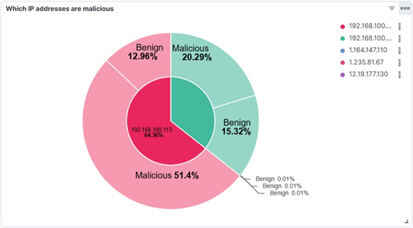

# ELK-SIEM-Security-Monitoring

## Project Overview

This project implements an **ELK-based Security Information and Event Management (SIEM) solution** to enhance cybersecurity monitoring for **CodeCraft Studios**, a growing software development company. The solution centralizes, analyzes, and visualizes security logs using **Elasticsearch, Kibana, and Elastic Cloud**, providing a cost-effective and scalable security monitoring framework.

## Features & Capabilities

✅ **Real-time Security Monitoring**: Aggregates logs from multiple sources  
✅ **Threat Detection**: Identifies malicious network activity and security risks  
✅ **Scalability**: Uses **Elastic Cloud** for seamless expansion  
✅ **Custom Dashboards**: Kibana visualizations for security insights  
✅ **Automated Log Analysis**: Machine Learning (ML) capabilities  
✅ **Cost-Effective**: Open-source ELK stack eliminates licensing costs  

---

## Architecture Overview

The **ELK SIEM** solution is hosted on **Elastic Cloud**, integrating:

- **Elasticsearch**: A search and analytics engine to store and query security logs.
- **Kibana**: A dashboard and visualization tool to analyze security metrics.
- **Machine Learning (ML) Features**: Automates threat detection and categorization.
- **Index Management**: Custom index mappings for efficient data processing.

### **System Components**
| Component      | Function |
|---------------|----------|
| **Elastic Cloud**  | Hosts the ELK stack for minimal downtime and high performance. |
| **Elasticsearch** | Stores and indexes security logs for real-time analysis. |
| **Kibana** | Provides dashboards, data visualization, and machine learning. |
| **Log Collection** | Security logs are directly uploaded to Kibana. |

---

## Implementation Process

### **1️⃣ Setup Elastic Cloud**
- Created an account on **[Elastic Cloud](https://cloud.elastic.co/)**
- Configured **Elasticsearch** and **Kibana** instances

### **2️⃣ Log Collection & Ingestion**
- Collected network logs from CodeCraft Studios
- Uploaded logs directly to Kibana’s **Machine Learning > File Data Visualizer**
- Adjusted **index mappings** to correct data types for visualization

### **3️⃣ Data Processing & Index Management**
- Modified index mappings to correctly classify fields (e.g., `port numbers` as `keywords` instead of `long` values)
- Used the **Index Management Console** for reindexing logs

### **4️⃣ Kibana Dashboard Creation**
- **Dashboards were created to analyze key security metrics**, including:
  - **Traffic Incoming from Different IPs**
  - **Malicious vs. Benign IPs**
  - **Protocol Usage & Connection State**
  - **Port Analysis & Attack Targeting**
  - **Heatmap for Network Traffic**

---

## Key Results & Outcomes

✅ **Enhanced Threat Visibility**: Identified malicious IPs & abnormal traffic patterns  
✅ **Real-time Security Dashboards**: Kibana visualizations helped monitor threats  
✅ **Reduced Manual Analysis Effort**: Machine learning automated log processing  
✅ **Improved Incident Response**: Faster identification of **malicious connections & targeted ports**  

---

## Sample Dashboards

### **Malicious vs. Benign IPs**


### **Network Traffic by Protocols**


### **Port Activity Analysis**


## Future Enhancements & Recommendations

**To further improve security monitoring, CodeCraft Studios should:**
- **Integrate additional data sources** (IAM logs, system logs, firewall logs)
- **Automate log collection** using **Filebeat & Metricbeat**
- **Enable real-time alerts** for critical security events
- **Implement incident response automation**
- **Conduct regular security audits & awareness training**

## References & Documentation

- **[Elastic Stack Documentation](https://www.elastic.co/docs)**
- **[Kibana Guide](https://www.elastic.co/guide/en/kibana/current/introduction.html)**
- **[Elasticsearch Guide](https://www.elastic.co/guide/en/elasticsearch/reference/current/documents-indices.html)**

---

## How to Run This Project

### **1️⃣ Prerequisites**
- ✅ **Elastic Cloud Account**
- ✅ **Basic Knowledge of Kibana & Elasticsearch**
- ✅ **Sample log files (provided in `sample_logs/`)**

### **2️⃣ Clone This Repository**
```bash
git clone https://github.com/yourusername/ELK-SIEM-Security.git
cd ELK-SIEM-Security
```
### **3️⃣ Upload Log Files to Kibana**
- **Navigate to Machine Learning > File Data Visualizer in Kibana**
- **Upload the security log files in CSV/JSON format**
- **Verify index mapping and adjust if needed**

### **4️⃣ Configure Dashboards**
- **Open Kibana**
- **Navigate to Dashboards**
- **Import the provided dashboard.json file**

### **5️⃣ Analyze Security Insights**
- **Use Kibana’s visualization tools to monitor threats**
- **Identify malicious connections, vulnerable ports, and attack patterns**


